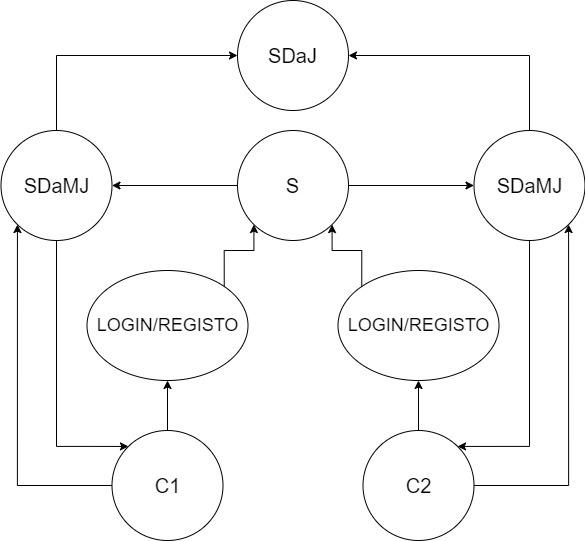
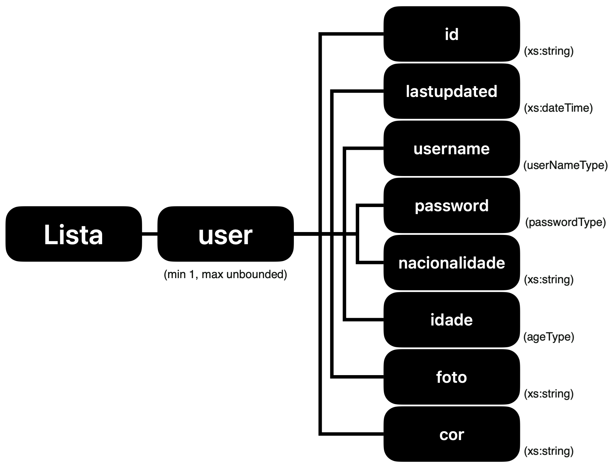
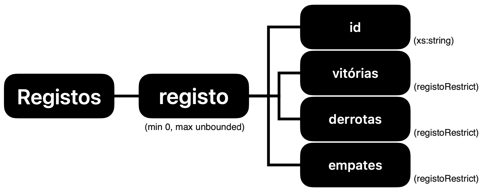
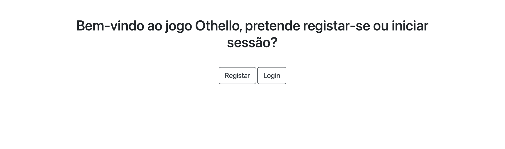
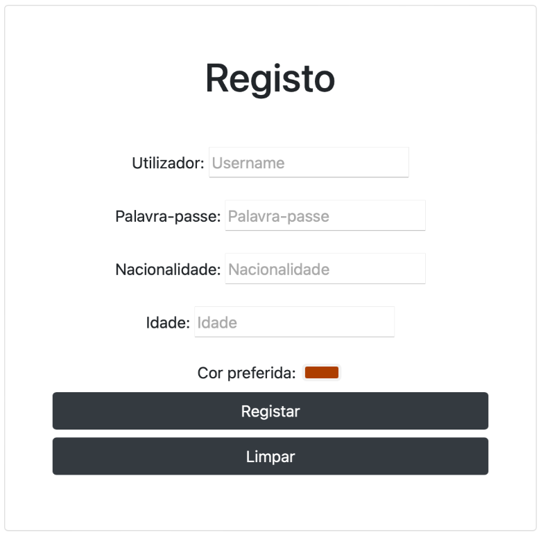
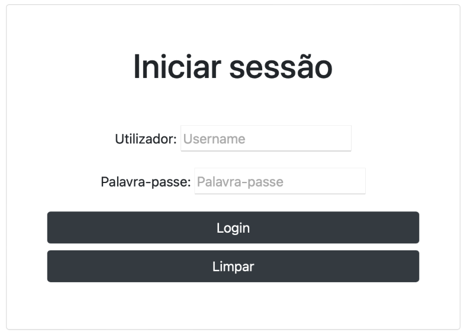
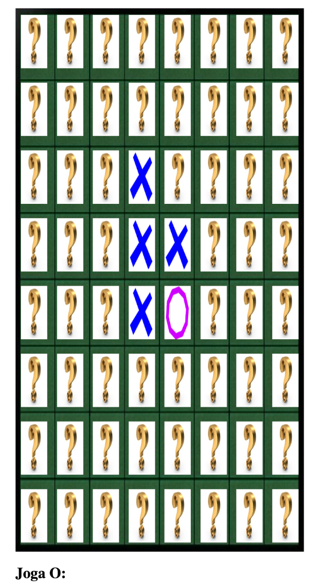

# 🎮 IeCD – Distributed Othello Game (TCP & Web)

> Practical assignment for the course **Infraestruturas Computacionais Distribuídas (IeCD)**  
> BSc in Computer Engineering and Multimedia – **ISEL**  
> Spring semester **2023 / 2024 (SV)**  

---

## 👥 Authors

- **Name:** Miguel Cordeiro — nº 49765 — 41D 
- **Name:** Ricardo Paiva — nº 50770 — 41D  
- **Name:** Rodrigo Caldeira — nº 50754 — 41D   
- **Instructor:** Eng. Porfírio Pena Filipe

---

## 📝 Project Overview

This project implements a **distributed version of the board game Othello** using:

- A **TCP server** that coordinates games between pairs of clients  
- **Console/GUI clients** with authentication and player matchmaking  
- Persistent storage based on **XML + XSD**, including players and statistics  
- A **web extension** built with **JavaServer Pages (JSP) and servlets** running on an application server (e.g. Apache Tomcat 10.1) that talks to the original TCP game server.  

The work is split in two main parts:

1. **Part 1 – TCP Game Engine**  
   - Iterative TCP server that manages a single game at a time  
   - Two console clients, each authenticated against an XML “database”  
   - Game logic (board, moves, winner detection) encapsulated in `Jogo` and `Jogador` classes.  

2. **Part 2 – Concurrent Server & Web Frontend**  
   - New **concurrent TCP server** capable of handling multiple pairs of players in parallel  
   - Improved application-level protocol and matchmaking (random opponent, list of online users, or waiting)  
   - JSP/Servlet based web UI for registration, login and playing Othello via a browser.  

---

## 🧪 Development

The system can be viewed as a pipeline of six main stages, from low-level TCP communication to the final web interface.

1. **Distributed architecture & concurrency model**  
2. **Transport protocol (TCP) and thin-client communication**  
3. **Game engine & client console application**  
4. **Persistent data layer (XML + XSD)**  
5. **Usage examples in the console client**  
6. **Web extension (JSP) and browser compatibility**  

---

### 1. System Architecture

The architecture evolved between Part 1 and Part 2:

- **Original model (Part 1):**  
  - Iterative TCP server.  
  - Waits for two clients, then creates a dedicated thread to run the whole game loop, blocking new games until the current one finishes.  
- **Updated model (Part 2):**  
  - Concurrent TCP server.  
  - Each client has a dedicated thread while choosing opponents.  
  - When two opponents are matched, a game thread is created for that pair, allowing **several games in parallel**.  

<p align="center">
  
</p>

> Figure: Architecture – concurrent TCP server with multiple client threads and game sessions.

---

### 2. TCP Transport & Thin-Client Protocol

Communication between clients and server relies on **TCP sockets** on a fixed port (5025).  

Main ideas:

- **Reliable transport (TCP):** connection-oriented, ordered and loss-controlled, split into connection setup, data transfer and connection teardown.  
- **Thin-client model:**  
  - The **server** holds the game state and validates moves.  
  - The **clients** mostly send commands (login, register, choose opponent, play move) and display responses.

---

### 3. Game Engine & Client Logic

The game logic is encapsulated in two core classes: `Jogo` and `Jogador`.  

- **`Jogo` (Game):**
  - Initializes the 8×8 Othello board  
  - Validates and applies moves  
  - Converts the board to a `String` to be sent to clients  
  - Detects end-of-game and decides the winner  

- **`Jogador` (Player / Client handler):**
  - Handles **authentication menus** (register / login / exit)  
  - Prints the board to the console  
  - Reads the player move (row and column)  
  - Handles both **console** and **JSP** entry points via two different constructors  
  - Manages socket lifecycle (connect / disconnect).  

---

### 4. Persistent Data: XML + XSD

User accounts and statistics are stored in **XML documents validated by XSD schemas**.  

- **Users XML:**  
  Each `<user>` element must include 8 fields: `id`, `lastupdated`, `username`, `password`, `nacionalidade`, `idade`, `foto`, `cor`.  
  The XML must contain at least one user to be valid.  

- **Records XML:**  
  `<registo>` elements link an `id` to `vitórias`, `empates`, and `derrotas`.  
  It is valid even if there are initially no records.  

- A dedicated **`User` class** uses helper classes `MyImage` and `XMLDoc` (provided by the instructor) to:
  - Load and validate the XML against XSD at startup  
  - Validate inputs in setters before persisting  
  - Read and update statistics after each game.  

<p align="center">
  
</p>

> Diagram of the XSD schema for the user list.

<p align="center">
  
</p>

> Diagram of the XSD schema for the game statistics.

---

### 5. Console Client – Usage Examples

The console client guides the user through registration, login and game execution.  

Typical flow:

1. **Main menu** – options:  
   - `1: Registo` (register)  
   - `2: Login`  
   - `3: Sair`  

2. **Register (option 1):**  
   - Ask for username, password and other profile data  
   - Create XML entries; first-time players get an automatic statistics record.  

3. **Login (option 2):**  
   - Ask for username + password  
   - If invalid, show an error and ask again  
   - If valid, proceed to opponent selection menu and then to the game loop.  

<p align="center">
  
</p>

> Console main menu (register / login / exit).

<p align="center">
  
</p>

> New user registration in the console client.

<p align="center">
  
</p>

> New user registration in the console client.

---

### 6. Web Extension with JSP & Servlets

To extend the system to the web, a **JSP/Servlet front-end** was added that reuses the original TCP game server:  

- Deployed on an application server such as **Apache Tomcat 10.1**  
- Communicates with the game server over TCP (thin client)  
- Can run on a **separate machine** from the TCP server, while browsers connect via HTTP.  

**Web workflow:**

1. **Landing page:** choice between **Register** and **Login**, mirroring the console menu.  
2. **Register page:** form with all required user data.  
3. **Login page:** username + password only.  
4. **Game page:** interactive 8×8 board; users play by clicking on the desired cell.

<p align="center">
  
</p>

> Web game screen with interactive Othello board.

#### Browser Compatibility

The web app was tested on modern browsers:

- **Google Chrome**  
- **Mozilla Firefox**  
- **Safari**  

With small CSS tweaks, the JSP pages behave consistently across these browsers. Older browsers such as Internet Explorer can present issues due to modern HTML5, CSS and Bootstrap features used in the implementation.  


---

All development and reporting are described in detail in the report:

```text
docs/IECD_TP2_49765_50754_50770.pdf
